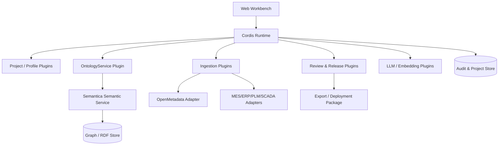

# 制造业本体工作台（Ontology Workbench）PRD

**版本**：0.1（评审稿）  
**状态**：Draft  
**产品形态**：面向 FDE 的本体构建、沉淀与客户交付平台  
**技术方向**：Cordis 插件运行时 + Semantica 语义引擎 + OpenMetadata 数据目录适配器

## 1. 产品摘要

我们为轻量 FDE 团队提供一套制造业本体工作台，让 FDE 能够在短时间内把客户的数据库、文档、术语和业务访谈内容转化为可审核、可复用、可交付的本体与知识图谱。

产品必须同时解决两个问题：

1. **内部沉淀**：将每次 FDE 项目中的概念、关系、映射、规则和交付经验沉淀为可复用的行业资产。
2. **客户交付**：快速为客户生成制造业语义模型、数据映射、校验规则、查询接口和部署包。

产品不是通用数据目录，也不是只生成 RDF 文件的研究工具。它是一套可组合的 FDE 工具链：连接数据、生成候选模型、人工审核、版本化、验证、发布和持续维护都在同一条工作流中完成。

## 2. 产品决策

| 决策项 | 结论 |
|---|---|
| 语义引擎 | Semantica，负责知识图谱、本体生成、SHACL、OWL/RDF 和 provenance |
| 数据目录 | OpenMetadata 作为可选连接器，负责数据资产、标签、负责人、质量和血缘 |
| 插件运行时 | Cordis，负责服务注册、依赖注入、事件、生命周期和可组合配置 |
| 标准 | OWL 2、RDF/JSON-LD、SHACL、PROV-O；内部接口使用版本化 JSON Schema |
| 第一交付对象 | 本体包 + 映射包 + 校验规则 + 查询模板 + 连接器配置 |
| 第一行业范围 | 离散制造的生产、设备、物料、工艺、质量和维护 |

## 3. 背景与问题

### 3.1 当前问题

- FDE 需要反复从零整理客户术语、实体、关系和数据源映射。
- 业务访谈、Excel、PDF、MES/ERP/PLM 数据库各自为政，无法形成统一语义模型。
- 交付结果经常停留在 PPT、表格和一次性脚本，难以复用和升级。
- 本体修改缺少版本、评审、影响分析和回滚机制。
- 技术团队希望替换 LLM、图数据库、数据连接器和 UI，而不修改平台核心。

### 3.2 机会

制造业项目存在高度重复的概念骨架：工厂、产线、设备、物料、产品、工艺、工单、质量特性、缺陷、维护事件和传感器观测。平台可以将行业共性资产产品化，将 FDE 的工作重点从“手工整理”转向“业务判断和交付设计”。

## 4. 目标与非目标

### 4.1 产品目标

- 新 FDE 可在半天内完成一个客户项目的工作区初始化。
- 将客户资料转成可审核的本体候选，支持人工确认、合并、拆分和补充。
- 复用行业本体和客户历史项目资产，减少重复建模。
- 让每个概念和关系都能追溯到来源、证据、审核人和版本。
- 一键生成客户可运行的本体交付包。
- 通过插件替换连接器、LLM、图存储、推理器、导出器和 UI 模块。

### 4.2 非目标（MVP）

- 不做完整 ERP/MES/PLM 替代系统。
- 不做通用 BI 或数据质量平台；数据目录能力优先通过 OpenMetadata 适配。
- 不承诺自动生成无需人工审核的生产级本体。
- 不在第一阶段建设复杂的分布式推理集群。
- 不把客户数据默认上传到公共云或第三方 LLM。

## 5. 用户与角色

| 角色 | 目标 | 主要权限 |
|---|---|---|
| FDE 建模人员 | 快速理解客户业务并构建本体 | 创建工作区、导入数据、编辑和提交审核 |
| FDE 负责人 | 保证交付质量和复用资产 | 审核、发布、回滚、管理模板 |
| 领域专家 | 校验制造业概念和关系 | 查看候选、批注、审批业务语义 |
| 数据工程师 | 接入数据源和维护映射 | 配置连接器、运行同步、处理映射错误 |
| 客户管理员 | 使用交付包并维护客户语义 | 管理本体版本、查看血缘、导出和授权 |
| 平台管理员 | 管理插件、模型和安全策略 | 安装插件、配置权限、审计和运行监控 |

## 6. 核心用户流程

### 6.1 FDE 建本体

1. 创建客户项目，选择制造业行业模板。
2. 导入数据源：数据库结构、Excel、PDF、接口样例、术语表或 OpenMetadata 服务。
3. 系统抽取候选实体、属性、关系、术语和来源证据。
4. FDE 在工作台中合并重复概念、调整层级、定义关系方向和基数。
5. 系统生成 OWL/SHACL，并使用样例数据执行校验。
6. 领域专家审核有争议项，FDE 处理意见并创建版本。
7. 发布到项目知识图谱，生成查询模板和交付包。

### 6.2 客户交付

1. 选择已审核的行业本体版本和客户扩展。
2. 选择客户数据源连接器和映射方案。
3. 运行映射预览，展示未匹配字段、冲突和缺失约束。
4. 执行 SHACL 校验和样例查询。
5. 生成交付包并部署到客户环境。
6. 后续数据同步产生变更建议，进入审核队列，不直接覆盖已发布版本。

### 6.3 本体沉淀

项目完成后，FDE 可以将客户无敏感信息的通用概念、映射模式、校验规则和查询模板提交到内部资产库，供其他项目搜索、引用和派生。

## 7. 功能需求

### 7.1 工作区与项目

- 创建、复制、归档客户项目。
- 项目绑定本体版本、数据源、插件 profile 和权限策略。
- 支持草稿、评审、已发布、已归档状态。
- 显示项目健康度：未处理候选、校验失败、映射覆盖率、待审批项。

### 7.2 数据接入

MVP 必须支持：

- CSV/XLSX、Markdown、PDF/DOCX 文本抽取。
- PostgreSQL、MySQL、SQL Server 中至少一种数据库。
- OpenMetadata REST API 适配器。
- 手工录入和 JSON 导入。

连接器统一实现 `Connector` 契约：发现资源、抽取元数据、生成证据、映射到本体、报告错误和增量同步。

### 7.3 候选抽取与本体生成

- 从结构化数据推断类、属性和关系。
- 从文档和访谈记录抽取术语、定义、同义词、实体和关系。
- 使用行业模板约束候选命名和层级。
- 输出置信度、证据片段、生成方法和模型版本。
- 支持规则抽取、LLM 抽取和人工录入三种来源。
- 允许对候选执行接受、拒绝、合并、拆分、改名、加约束和标记争议。

### 7.4 本体编辑器

- 类层级树和关系图双向查看。
- 类、对象属性、数据属性、枚举和约束的表单编辑。
- 支持 namespace、IRI、标签、多语言名称、定义和同义词。
- 支持关系方向、domain/range、基数和必填约束。
- 显示变更 diff、影响范围和来源证据。
- 所有编辑均产生可审计事件。

### 7.5 映射与数据验证

- 数据表/字段到类/属性的映射。
- 术语到标准概念的映射。
- 映射覆盖率和未匹配项报告。
- SHACL 校验、错误定位和修复建议。
- 样例实例生成和查询回放。
- 支持映射规则版本化，不覆盖历史运行结果。

### 7.6 版本、评审与发布

- 本体、映射、连接器配置和查询模板独立版本化，也可组合成发布版本。
- 支持提交评审、评论、审批、驳回和重新提交。
- 支持版本 diff 和兼容性检查。
- 支持发布、回滚、导出和撤销发布。
- 发布包必须包含 manifest、校验和、依赖插件版本和生成时间。

### 7.7 资产库

- 行业模板、客户扩展、术语、映射模式、规则和查询模板可搜索。
- 支持从资产派生新版本，并记录来源。
- 支持资产质量评分、使用次数、最近更新时间和负责人。
- 默认不沉淀客户敏感实例数据，只沉淀经过脱敏和审核的语义资产。

### 7.8 交付与集成

- 导出 OWL/Turtle、RDF/XML、JSON-LD、SHACL、CSV 映射和 JSON manifest。
- 提供 GraphQL/REST 查询接口和 MCP 工具接口。
- 可生成 Docker Compose 或 Kubernetes 部署包。
- 可选推送到 OpenMetadata glossary、tag、custom property 和 lineage。
- 支持客户环境离线运行。

### 7.9 管理与审计

- 用户、团队、项目和插件权限。
- 对数据源凭据进行密钥引用，不在日志中输出明文。
- 记录登录、导入、生成、编辑、审批、发布、导出和插件变更。
- 支持按项目、用户、时间和对象查询审计记录。

## 8. 制造业领域模型（MVP）

### 8.1 核心类

`Organization`、`Plant`、`Workshop`、`ProductionLine`、`WorkCenter`、`Equipment`、`Product`、`Material`、`BOM`、`Routing`、`Operation`、`ProcessPlan`、`WorkOrder`、`Inspection`、`QualityCharacteristic`、`Defect`、`MaintenanceOrder`、`Alarm`、`SensorObservation`、`Person`、`DataAsset`。

### 8.2 核心关系示例

```text
Plant contains Workshop
Workshop contains ProductionLine
ProductionLine has Equipment
Product has BOM
Product follows ProcessPlan
ProcessPlan contains Operation
WorkOrder produces Product
Operation consumes Material
Equipment performs Operation
Inspection checks Product
Inspection detects Defect
MaintenanceOrder repairs Equipment
SensorObservation observedOn Equipment
DataAsset describes or records a domain entity
```

### 8.3 语义要求

- 所有实体和关系必须有唯一标识和来源。
- 生产事实需要支持有效时间和记录时间。
- 质量、设备状态和工艺参数需要支持单位、数值范围和测量方法。
- 同一设备、物料或产品在不同系统中的标识需要支持实体对齐。
- 客户扩展不得修改行业核心概念的含义，只能增加子类、属性或映射。

## 9. 技术架构



### 9.1 Cordis 运行时职责

- 加载 profile、bundle 和项目 patch。
- 根据 `inject` 解析服务依赖。
- 注册和卸载服务、事件监听器、工具和 UI slot。
- 管理插件生命周期和可撤销 effect。
- 不包含制造业业务规则，不直接依赖具体图数据库。

Cordis 对齐约束：插件通过 `inject` 声明依赖，服务挂载到稳定的 `ctx.<key>`；插件之间通过 typed events 通信，不直接 import 具体实现；注册必须经由可撤销的 effect/listener 完成，卸载时不得遗留服务、事件监听器或定时任务。客户交付以 profile/bundle 组合，客户 patch 可审计、可回滚。

### 9.2 Semantica 服务职责

- 知识图谱构建、实体关系处理和 provenance。
- 本体生成、导入、导出、评估和版本辅助。
- SHACL shape 生成和校验。
- 图查询、推理和语义检索。

建议通过独立 Python 服务或 worker 调用 Semantica，Cordis 使用稳定的 HTTP/gRPC/任务队列接口与其通信。

### 9.3 OpenMetadata 适配器职责

- 发现数据库、表、字段、标签、负责人和血缘。
- 将 OpenMetadata 实体映射到 `DataAsset` 等内部概念。
- 将审核后的业务术语和标签回写到 OpenMetadata。
- 保留 OpenMetadata entity id、FQN、版本和同步时间。

## 10. 插件契约

插件 manifest 示例：

```yaml
id: connector.openmetadata
version: 0.1.0
provides:
  - connector
  - metadata-source
requires:
  - project-store
  - credential-store
configSchema: schemas/openmetadata-connection.json
permissions:
  - project.read
  - source.read
events:
  emits: [source.discovered, mapping.proposed]
  listens: [project.created, release.published]
```

最小服务接口：

```ts
interface Connector {
  discover(input: DiscoverInput): Promise<DiscoveryResult>
  ingest(input: IngestInput): AsyncIterable<SourceRecord>
  map(input: MappingInput): Promise<MappingProposal[]>
  validate(input: ValidationInput): Promise<ValidationReport>
}

interface OntologyService {
  generate(input: GenerateInput): Promise<OntologyDraft>
  validate(input: ValidateInput): Promise<ValidationReport>
  diff(a: OntologyVersion, b: OntologyVersion): Promise<OntologyDiff>
  export(input: ExportInput): Promise<Artifact[]>
}
```

## 11. 数据模型

核心对象：

- `Workspace`：FDE 或团队的工作空间。
- `Project`：一个客户或项目的隔离边界。
- `Ontology`：本体逻辑身份。
- `OntologyVersion`：不可变版本，包含 classes、properties、constraints、namespaces。
- `Evidence`：文本片段、表字段、样例值、访谈记录或规则来源。
- `Mapping`：外部资源到本体概念的映射。
- `ValidationRun`：校验输入、规则版本、结果和错误。
- `ReviewTask`：待审核对象、意见、状态和审批人。
- `Release`：本体、映射、插件和部署配置的组合发布物。
- `Plugin`：插件 manifest、版本、权限、配置和运行状态。
- `AuditEvent`：不可变审计事件。

实体必须保留 `id`、`tenant/project_id`、`version`、`created_by`、`created_at`、`source` 和 `provenance` 等通用字段。

## 12. MVP 范围

### MVP 必须具备

- 项目和本体版本管理。
- CSV/XLSX、文本/PDF、至少一种 SQL 数据库接入。
- OpenMetadata 只读接入。
- 候选实体/关系抽取和人工审核。
- 图形化本体编辑器。
- OWL/Turtle、JSON-LD 和 SHACL 导出。
- 样例数据校验、映射覆盖率和错误报告。
- 行业核心概念模板。
- Cordis 插件加载、配置和基本生命周期。
- 可下载的客户交付包。

### MVP 暂缓

- 多租户公有云 SaaS。
- 自动实体消歧的复杂模型训练。
- 全量实时 IoT 流处理。
- 复杂 OWL DL 推理优化。
- 在线多人协同编辑。
- OpenMetadata 双向全量同步。

## 13. 里程碑

### M0：技术验证（2 周）

- Cordis 加载三个示例插件：项目存储、LLM、连接器。
- Semantica 完成一个制造业样例本体生成、SHACL 校验和 Turtle 导出。
- 定义 `OntologyService`、`Connector`、`Release` 三组接口。

验收：命令行完成“输入 CSV + 术语表 → 本体草稿 → 校验报告 → Turtle”。

### M1：FDE 内部试用（4-6 周）

- Web 工作区、本体编辑器、候选审核和版本管理。
- 支持 CSV/XLSX、文档和一种 SQL 数据库。
- 建立离散制造核心模板。
- 输出可下载交付包。

验收：内部 FDE 能独立完成一个脱敏样例项目。

### M2：真实项目交付（6-8 周）

- OpenMetadata 适配器。
- MES/ERP/PLM 中至少一个真实连接器。
- 映射覆盖率、血缘展示、审计和发布回滚。
- 客户环境 Docker/Kubernetes 部署。

验收：至少一个客户项目完成上线或验收，交付包可在客户环境运行。

### M3：资产平台化（持续迭代）

- 行业资产库和派生机制。
- 插件市场/内部插件目录。
- 多项目模板、质量评分和使用分析。
- 增量同步和变更影响分析。

## 14. 关键指标

### 效率

- 工作区初始化时间 ≤ 30 分钟。
- 首版本体草稿生成 ≤ 2 小时（包含人工审核）。
- 新客户项目复用资产比例 ≥ 40%。
- 同类连接器复用率 ≥ 70%。

### 质量

- 发布版本 100% 通过结构校验和 SHACL 基础校验。
- 每个类和关系都有来源或人工确认记录。
- 关键字段映射覆盖率 ≥ 90%。
- 版本发布可回滚，且回滚后查询结果可复现。

### 交付

- 交付包可在无外网环境安装。
- 客户能独立运行样例查询和校验。
- 插件升级不改变已有本体版本的语义结果。

## 15. 安全与合规

- 客户项目数据默认隔离，项目之间不可互读。
- 凭据使用外部 secret store 或环境注入，禁止进入 Git 和普通日志。
- 支持脱敏后再进入内部资产库。
- 所有 LLM 调用记录模型、版本、提示模板和数据范围。
- 插件按最小权限访问项目、数据源、文件和网络。
- 客户环境支持完全离线部署和私有模型。
- 发布物包含依赖清单和完整性校验值。

## 16. 风险与应对

| 风险 | 影响 | 应对 |
|---|---|---|
| Semantica 版本变化快 | 语义服务升级成本高 | 封装 `OntologyService`，锁定版本并写契约测试 |
| Cordis API 尚在演进 | 插件兼容性风险 | 仅让业务插件依赖内部稳定接口，隔离 Cordis 适配层 |
| LLM 生成错误本体 | 交付质量风险 | 强制证据、人工审核、SHACL、样例数据和发布门禁 |
| 客户系统字段质量差 | 映射失败 | 先做发现报告和人工确认，不自动覆盖映射 |
| 过度追求通用模型 | 产品复杂度失控 | 先聚焦离散制造核心领域和真实项目 |
| 双向同步造成语义污染 | 数据和本体互相覆盖 | 默认单向读取；回写必须审批、可追踪、可撤销 |

## 17. 首个试点建议

选择一个数据系统相对完整、业务专家可参与、范围明确的离散制造客户，优先做“设备维护 + 质量追溯”或“生产工艺 + 工单”中的一个闭环。试点只承诺：

- 一套核心本体和客户扩展；
- 两类数据源；
- 三个可演示查询；
- 一套 SHACL 校验；
- 一个可部署交付包。

试点结束后再决定是否扩展到实时 IoT、复杂推理和完整 OpenMetadata 双向集成。

## 18. 页面与典型用户故事

### 18.1 页面清单

- 项目看板：进度、质量门禁、待审核任务、最近运行和当前发布版本。
- 数据源向导：连接配置、抽样范围、发现结果、字段预览和同步历史。
- 本体编辑器：左侧类树、中间关系图、右侧属性/约束/证据，另提供 Turtle/JSON-LD 代码视图。
- 候选审核队列：按置信度、来源、冲突和影响范围筛选，支持接受、拒绝、合并和批量处理。
- 映射工作台：源字段、目标属性、转换函数、样例值和校验结果并排显示。
- 质量报告：SHACL 错误、覆盖率、重复、孤儿、来源缺失和阻断级问题。
- 版本中心：版本 diff、影响分析、评审意见、发布和回滚。
- 资产库：行业模板、术语、映射规则、查询模板和插件。
- 插件中心：安装、配置、启停、健康状态、权限和执行日志。
- 发布中心：交付包清单、签名、下载、环境晋级和部署状态。

### 18.2 典型用户故事

- 作为 FDE，我可以选择制造业模板并导入客户表结构，系统给出带证据的候选概念和关系。
- 作为领域专家，我可以只查看业务术语、关系和样例，不需要接触底层连接器。
- 作为项目经理，我可以看到阻断级校验结果，并在问题关闭后批准发布。
- 作为客户管理员，我可以在内网配置凭据，确认数据不离开客户环境。
- 作为插件开发者，我可以实现 `Connector` 契约并在不修改核心代码的情况下挂载新数据源。

## 19. 客户交付包规范

交付包是可复现、可部署、可审计的不可变制品：

```text
ontology/
  ontology.ttl
  ontology.jsonld
  namespaces.yaml
  terminology.csv
validation/
  shapes.ttl
  sample-data.jsonld
  validation-report.json
mappings/
  source-to-ontology.yaml
  transformations.yaml
connectors/
  profile.yaml
  openmetadata.yaml
runtime/
  cordis-profile.yaml
  semantica-version.txt
  docker-compose.yaml
apis-queries/
  openapi.json
  queries/
governance/
  provenance-manifest.json
  version-diff.md
  sbom.json
runbook/
  install.md
  rollback.md
  backup-restore.md
  troubleshooting.md
manifest.json
```

`manifest.json` 必须包含本体版本、父版本、插件版本、模型版本、输入快照哈希、产物哈希、生成时间、审核人、许可证和部署目标。发布物遵循 SemVer：MAJOR 表示删除/重命名或破坏映射，MINOR 表示向后兼容扩展，PATCH 表示约束或文档修复。

## 20. API 与任务约定

最小 API：

```text
POST /projects/{id}/ontology/versions
POST /ontology/versions/{id}/generate
POST /ontology/versions/{id}/validate
GET  /ontology/versions/{id}/diff?base={version}
POST /ontology/versions/{id}/release
POST /connectors/{plugin}/runs
GET  /jobs/{jobId}
GET  /artifacts/{artifactId}/download
```

长任务统一返回 `jobId`，事件必须携带 `tenantId`、`projectId`、`correlationId` 和 `idempotencyKey`。连接器的导入、映射和发布操作必须支持 checkpoint、重试和幂等；失败进入可重放的死信任务。

## 21. 部署形态与可观测性

- FDE 本地：Docker Compose 启动 UI/API、Cordis、Worker、Semantica、PostgreSQL、MinIO 和 GraphStore；通过 profile 关闭可选组件。
- 客户私有化：Helm 部署，支持 air-gapped 镜像仓库、本地模型和离线插件包。
- 后续 SaaS：控制面多租户，客户数据平面留在客户 VPC 或边缘环境。
- API、Worker、连接器和 Semantica 之间用 OpenTelemetry trace 贯穿；统一 `correlationId`。
- 记录任务成功率、队列深度、候选生成耗时、SHACL 耗时、插件健康、查询 P95 和 LLM 调用成本。
- 所有长任务支持断点、指数退避、死信和人工重试；发布产物用内容哈希校验。

## 22. 技术预研闸门与端到端验收剧本

### 22.1 M0 必须验证

- Semantica 能否稳定生成目标 OWL/SHACL，并保留 provenance、增量构建和目标格式导出。
- Cordis 能否完成插件依赖解析、加载、卸载和 effect 回收。
- Cordis 与 Python Semantic Service 的跨进程调用、错误传递和超时处理。
- GraphStore、LLMProvider 和 Connector 替换时，`OntologyService` 契约保持不变。

若任一项失败，替换具体实现，不改变产品侧 Ontology Contract。

### 22.2 端到端验收剧本

输入一份 MES 工单 CSV、一套设备 PostgreSQL 数据和一份质量 Excel/文档（至少 50 个字段、10,000 条实例）。FDE 完成导入、候选审核、映射、SHACL 校验和发布；随机抽查 100 条实例，与源数据一致率至少 95%；每个错误可定位到源字段；在干净环境重新部署交付包后查询结果一致；模拟版本升级后回滚时间不超过 10 分钟。

### 22.3 指标口径

- 本体覆盖率 = 客户签字的需求实体/关系中已建模并映射的数量 ÷ 需求总数。
- 候选接受率 = FDE 保留候选数 ÷ 候选总数，按项目统计并保留拒绝原因。
- 可复现性 = 同一输入快照、插件和模型版本重放后产物哈希或三元组 diff 一致。
- 关键约束通过率按阻断级 SHACL 结果计算，不能用警告替代。

## 23. 测试策略

- **契约测试**：插件 manifest、服务 JSON Schema、事件 schema、版本兼容性和权限声明。
- **生命周期测试**：插件加载、依赖解析、热更新、卸载和 effect 回收后，Context 不残留。
- **Golden Corpus 回归**：固定离散装配、设备维护和质量追溯三类样例；Semantica、LLM 或插件升级必须比较类/关系/SHACL 和产物哈希。
- **端到端测试**：OpenMetadata mock 或真实样例 → 增量同步 → 候选映射 → 审批 → OWL/SHACL → 发布包；重复消息和断点续跑不得产生重复实例。
- **安全测试**：租户越权、插件越权网络/文件访问、密钥泄漏、恶意插件签名、提示注入和出站域名策略。
- **性能测试**：记录 10 万资产增量、10 万三元组校验和多项目并发下的 P95、CPU、内存和失败率。

## 24. 基础参考资料（选型）

- [OpenMetadata System Architecture](https://docs.open-metadata.org/v1.11.x/developers/architecture)
- [OpenMetadata Features](https://docs.open-metadata.org/v1.12.x/features)
- [Semantica Ontology Module](https://github.com/semantica-agi/semantica/blob/main/docs/reference/ontology.md)
- [Semantica Core Concepts](https://github.com/semantica-agi/semantica/blob/main/docs/concepts.md)
- [DeepSeek Harness Cordis Primer](https://github.com/deepseek-ai/deepseek-harness/blob/master/docs/cordis-primer.md)
- [DeepSeek Harness Architecture](https://github.com/deepseek-ai/deepseek-harness/blob/master/docs/architecture.md)

## 25. FDE 工作台增强规划：参考 Foundry

### 25.1 Foundry 值得借鉴的核心思想

Foundry 的 Ontology 不是单纯的类和关系字典，而是位于数据资产之上的 operational layer：它将真实世界对象映射到数据，并同时定义对象、链接、动作、函数和权限。[Ontology overview](https://www.palantir.com/docs/foundry/ontology/overview) 这对我们的启发是：工作台不能只帮助 FDE“画本体”，还要帮助 FDE 验证本体是否能支撑一个真实工作流。

Foundry Workshop 以对象层为主要构建单元，利用 Actions 写回对象、Functions 承载业务逻辑、Derived properties 计算运行时属性，并通过统一组件和事件系统搭建操作应用。[Workshop overview](https://www.palantir.com/docs/foundry/workshop/overview) Foundry Actions 将创建、修改、删除和建立链接封装为有权限和校验的事务。[Actions overview](https://www.palantir.com/docs/foundry/workshop/actions-overview)

Foundry Automate 则将对象条件、时间条件和动作效果组合起来，用于告警、审批、数据异常处理和外部系统调用。[Automate overview](https://www.palantir.com/docs/foundry/automate)

### 25.2 我们当前工作台需要补齐的能力

#### P0：直接提升 FDE 效率

1. **需求到本体的追踪矩阵**

   将访谈需求、业务术语、源字段、候选概念、最终类/关系、校验规则和交付查询串起来。每个本体元素都能回答“为什么存在、来自哪里、谁确认、哪些交付物使用它”。

2. **本体项目模板和向导**

   按“设备维护”“质量追溯”“生产工艺”“工单执行”提供任务型模板，而不是只提供空白类树。模板应自带目标问题、推荐数据源、核心概念、样例查询和质量门禁。

3. **数据剖析与映射助手**

   接入后先展示字段类型、空值率、唯一率、枚举值、时间范围、重复率和疑似主键，再生成映射候选。FDE 先看数据质量，再决定是否建模，减少错误本体。

4. **证据优先的 AI 审核队列**

   候选项必须同时显示原文片段、源字段、样例值、相似概念、生成规则、模型版本和置信度。支持批量接受、拒绝、合并、改名和“以后不要这样推荐”的反馈。

5. **映射冲突中心**

   专门处理同义词、同名异物、单位不同、枚举不同、主键不一致、时间口径不同和一对多映射。将冲突转成任务，而不是隐藏在导入日志中。

6. **样例查询和交付预览**

   FDE 发布前应能用客户数据预览“按设备查维护记录”“按工单查质量缺陷”“按产品查工艺路线”等结果，并显示每个结果的来源和本体版本。

7. **客户环境检查器**

   发布前检查目标环境的插件、图存储、模型、凭据、网络和版本兼容性，生成可读的 preflight 报告，避免交付现场才发现依赖缺失。

#### P1：让本体可以驱动客户应用

8. **对象视图（Object View）**

   每个核心对象自动生成标准详情页：属性、关联对象、时间线、数据来源、质量状态、最近事件和可用动作。Foundry 将对象视图作为统一的对象展示方式，这个模式适合做成轻量的自动生成器。

9. **动作类型（Action Type）**

   在本体中定义安全的业务动作，例如“确认缺陷”“关闭维护工单”“批准映射”“标记设备停机”。动作包含参数、权限、前置校验、影响对象、外部系统调用和审计记录。

10. **FDE 交付应用模板**

   提供可复用的“告警收件箱”“质量缺陷处理”“设备维护台”“本体审核台”“数据映射台”。借鉴 Workshop 的模板和组件思路，但只提供少量制造业高频模板。

11. **规则自动化**

   支持“当高优先级缺陷出现时创建审核任务”“当设备传感器超过阈值时生成告警”“当映射覆盖率下降时通知负责人”。第一阶段只做通知和创建任务，后续再允许自动写回客户系统。

12. **接口与能力抽象**

   对具有共同能力的对象定义轻量接口，例如 `Maintainable`、`Measurable`、`Assignable`、`QualityInspected`。这样同一套维护或告警工作流可以适用于不同设备类型。Foundry 的 Interface 采用类似的多态建模，但官方文档也显示其部分应用支持仍在演进，因此我们先把它作为内部 Ontology Contract 能力，不让客户必须理解接口实现细节。[Interfaces overview](https://www.palantir.com/docs/foundry/interfaces/interface-overview)

#### P2：规模化交付能力

13. **Use Case / 解决方案包**

   将本体版本、映射、查询、动作、工作流、连接器和 UI 模块组合成一个“解决方案包”，可复制给下一个客户，再通过 customer patch 修改。Foundry 的 use case 会组织应用、对象类型、动作类型和 backing data，这个组织方式适合借鉴。[View resources](https://www.palantir.com/docs/foundry/use-cases/view-resources)

14. **对象级和属性级权限**

   除项目级 RBAC 外，支持按工厂、产线、设备、敏感属性和环境控制可见性。Foundry 明确区分 ontology resource 权限和 object/link 数据权限，我们也应将“能看模型定义”和“能看客户实例”分开。[Object permissioning](https://www.palantir.com/docs/foundry/object-permissioning/overview)

15. **本体健康与使用分析**

   展示未使用概念、孤儿关系、低覆盖字段、频繁失败映射、查询热点、动作失败率和每个概念的来源完整性，帮助 FDE 决定下一轮该治理什么。

### 25.3 不建议照搬 Foundry 的部分

| Foundry 做法 | 我们的处理 |
|---|---|
| 全套数据平台和应用生态 | 只保留本体工作台、交付运行时和高频制造模板 |
| 强绑定平台内数据层 | 使用 Connector、GraphStore 和 ArtifactStore 抽象，允许客户已有系统继续作为事实来源 |
| 大而全的低代码应用构建器 | 先做 4-5 个制造业应用模板和可配置模块，不做通用 App Builder |
| 复杂实时流和全量写回 | 先支持批处理、告警和人工确认；写回必须显式授权 |
| 完整商业化权限体系 | 先实现项目、工厂、产线、对象和敏感属性五级权限 |
| 专有平台对象模型 | 采用 OWL/RDF/SHACL/JSON-LD，保留导入导出和客户可迁移性 |

### 25.4 建议新增的产品分层

现有 PRD 的“本体工作台”应拆成四个连续层次：

```text
Evidence Layer   访谈、文档、字段、样例值、来源和证据
Semantic Layer   类、属性、关系、约束、术语、映射和版本
Operational Layer 对象视图、动作、规则、任务和写回
Delivery Layer   API、查询、应用模板、插件 profile 和交付包
```

FDE 可以停在 Semantic Layer 完成交付，也可以继续进入 Operational Layer，快速交付一个可用的“设备维护台”或“质量缺陷处理台”。这会让本体从静态文档升级为客户可操作的业务基础设施。

### 25.5 建议新增的数据对象

- `Requirement`：客户需求、访谈问题和验收标准。
- `Evidence`：证据片段、源字段、样例值和文件定位。
- `ObjectView`：对象详情页的默认布局和字段策略。
- `ActionType`：参数、规则、权限、写回和副作用。
- `AutomationRule`：条件、触发器、效果、失败策略和审批策略。
- `UseCasePackage`：本体、映射、应用、动作、连接器和部署配置的组合。
- `PreflightReport`：目标环境兼容性和部署前检查结果。
- `OntologyHealthSnapshot`：覆盖率、孤儿、冲突、使用率和质量趋势。

### 25.6 版本优先级调整

建议把原来的路线调整为：

- **MVP**：补齐需求追踪、数据剖析、证据审核、映射冲突、样例查询和交付 preflight。
- **MVP+**：加入 Object View、动作类型和 3 个制造业交付应用模板。
- **试点版**：加入通知型自动化、对象/属性权限、Use Case Package 和健康度。
- **生产版**：再考虑自动写回、实时流、复杂函数和通用低代码应用构建。

Foundry 最值得借鉴的不是某个具体 UI，而是“本体必须连接对象、动作、应用和治理”的完整闭环。我们的差异化应保持在制造业语义模板、FDE 交付效率、跨系统映射和可迁移的开源标准上。
